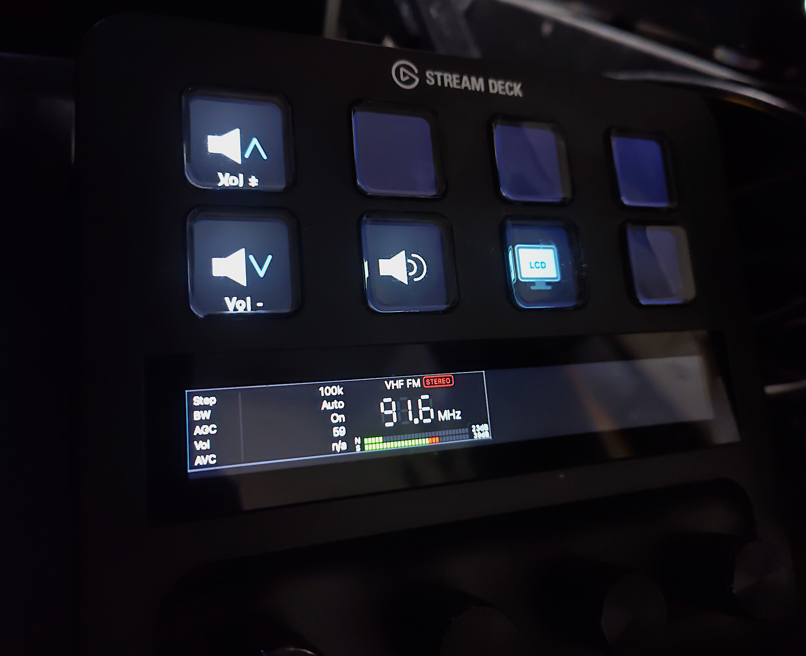

# ats-mini Stream Deck Plugin



[ATS-Mini](https://github.com/esp32-si4732/ats-mini) is an excellent open-source DSP radio project based on ESP32 + SI4732/SI4735. It comes with a well-designed serial remote command API, and this plugin leverages that API to control the radio directly from a Stream Deck on macOS.

> **Note:** The Dial Tune action supports both preset-based tuning (slots from `memories.json`) and VFO-style continuous tuning. The Dial Band action switches between the 28 firmware bands.

---

## Requirements

| | Version |
|--|--|
| macOS | 10.15 Catalina or later |
| Stream Deck software | 6.6 or later |
| Node.js (bundled in plugin) | 20 |
| ATS-Mini firmware | v1235+ (with patches from this repo) |

---

## Setup

### 1. Install prerequisites

```sh
# Stream Deck CLI
npm install -g @elgato/cli

# Node.js v20 or later (nodebrew / nvm / fnm etc.)
node --version
```

### 2. Install dependencies

```sh
cd ats-mini
npm install
```

Key packages:

| Package | Version | Purpose |
|---------|---------|---------|
| `@elgato/streamdeck` | ^2.0.4 | Stream Deck SDK v2 |
| `serialport` | ^12.0.0 | USB serial communication |
| `rollup` | ^4.0.0 | Bundler |
| `typescript` | ^5.0.0 | TypeScript compiler |

### 3. Build and install

```sh
npm run build
streamdeck install com.hogehoge.ats-mini.sdPlugin
```

### 4. Development mode (watch + auto-rebuild)

```sh
npm run watch
```

---

## ATS-Mini firmware configuration

The plugin communicates over USB serial. You need to enable USB mode on the device itself.

**On the ATS-Mini:** `Settings` → `USB Mode` → **`Ad Hoc`**

> The default is `OFF`. After reflashing the firmware, this setting may reset — check it and set to `Ad Hoc` if needed.

---

## Firmware flashing (macOS)

### Prerequisites

| Tool | Notes |
|------|-------|
| `~/bin/arduino-cli` | Download from [arduino/arduino-cli releases](https://github.com/arduino/arduino-cli/releases) — macOS binary, place in `~/bin/` |
| ESP32 board package | `arduino-cli core install esp32:esp32` |
| Firmware source | Clone [soresore19xx/ats-mini-firmware](https://github.com/soresore19xx/ats-mini-firmware) |

### Hardware variant — choose the right profile

The ATS-Mini ships with two different PSRAM configurations. **Using the wrong profile will cause a boot failure.**

| Profile | PSRAM type |
|---------|-----------|
| `esp32s3-ospi` (default) | OPI (Octal) — most units |
| `esp32s3-qspi` | Quad SPI — some alternative variants |

### Serial port detection

```sh
# Confirm ATS-Mini is recognized
ls /dev/tty.usbmodem*
```

> The plugin uses `/dev/cu.usbmodem*`; the flash tool uses `/dev/tty.usbmodem*`. Both refer to the same physical port — **stop the plugin before flashing**.

### Flash procedure

```sh
# 1. Stop the plugin to release the serial port
streamdeck stop com.hogehoge.ats-mini

# 2. Flash (auto-detects port, skips if already up-to-date)
#    Run from the cloned firmware repo root
./scripts/flash.sh

# 3. Restart the plugin
streamdeck restart com.hogehoge.ats-mini

# For Quad SPI PSRAM variant:
./scripts/flash.sh esp32s3-qspi
```

### Force flash (ignore git state)

```sh
./scripts/flash-force.sh
# or: ./scripts/flash-force.sh esp32s3-qspi
```

### Post-flash checklist

1. **Power cycle** — turn the receiver off and back on (the hard-reset via RTS that arduino-cli performs is sometimes insufficient)
2. **USB Mode** — `Settings` → `USB Mode` → check the value; if it shows `OFF`, set it to **`Ad Hoc`**
3. Confirm plugin reconnects (status LED / LCD should come back within 5 s)
4. Verify the status packet field count in the Stream Deck log if the packet format was changed

---

## Serial port notes

### Auto-detection
The plugin automatically selects the latest `/dev/cu.usbmodem*` device (`AtsSerial.detectPort()`).

### Connection and reconnection
- After connecting, the plugin sends `t` to start 500ms status output from the firmware.
- Baud rate is fixed at 115200 (USB CDC ignores the actual rate setting).
- When the ATS-Mini is power-cycled, SerialPort fires a `close` event → `atsService` detects it and automatically reconnects after 5 seconds.
- On reconnect, LCD state is reset to `true` (device always starts with LCD on).
- **Port busy:** The plugin holds the serial port while running. Release it before flashing firmware.

```sh
# Check if the plugin process is running
ps aux | grep "com.hogehoge.ats-mini.*index.js" | grep -v grep

# Release the port
streamdeck restart com.hogehoge.ats-mini
```

### Zombie process guard
Stream Deck closes stdout/stderr of old instances instead of sending SIGKILL. The plugin uses a PID file (`/tmp/ats-mini.pid`) at startup to terminate any previous instance.

### EPIPE handling
When Stream Deck closes the old instance's stdout/stderr, an EPIPE error occurs. This is absorbed at the stream level in `index.ts`.

---

## Actions

All keypad buttons use dynamically generated SVG icons (dark radial gradient background, light blue `#55aaff` accent). No static PNG assets are used for the active button state.

### Tune (memory preset)
- **UUID:** `com.hogehoge.ats-mini.tune`
- **Icon:** antenna with radio wave arcs
- Configure a **slot number (1-based)** in the button settings.
- Button label: `#slot / frequency` (e.g. `#1 / 594 kHz`)
- Pressing the button tunes immediately to the frequency and mode defined in `memories.json`.
- Sends `F{Hz},{mode}\r` to firmware (e.g. `F594000,AM\r`).

### Vol+ (volume up)
- **UUID:** `com.hogehoge.ats-mini.vol-up`
- **Icon:** speaker + upward chevron (blue)
- **Hold support:** sends `V` every 150ms while held down.

### Vol- (volume down)
- **UUID:** `com.hogehoge.ats-mini.vol-down`
- **Icon:** speaker + downward chevron (blue)
- **Hold support:** sends `v` every 150ms while held down.

### Mute toggle
- **UUID:** `com.hogehoge.ats-mini.vol-mute`
- **Icon:** speaker with sound waves (unmuted) / speaker with red × (muted)
- Sends `Q` to toggle hardware mute on the firmware side.
- Icon updates to reflect current mute state.
- Automatically resets to unmuted state when the ATS-Mini is power-cycled (detected via serial reconnect).

### LCD Display toggle
- **UUID:** `com.hogehoge.ats-mini.display-toggle`
- **Icon:** monitor with blue screen (on) / monitor with dark screen and × (off)
- Sends `o` (wake/LCD on) or `O` (sleep/LCD off).
- LCD state is shared with the Dial Tune action via `atsService.lcdOn`.
- Resets to ON on ATS-Mini reconnect (device default).

### Status Panel (Stream Deck+ encoder)
- **UUID:** `com.hogehoge.ats-mini.status-panel`
- **Controller:** Encoder (Stream Deck+)
- **Dial button:** same realistic knob SVG as Dial Tune

#### LCD display layout

The encoder LCD shows a 200×92px panel with five rows of radio parameters:

| Row | Label | Value example |
|-----|-------|---------------|
| 0 | Step | 9kHz |
| 1 | BW | 3kHz |
| 2 | AGC / Att | On / 02 |
| 3 | Vol | 45 |
| 4 | AVC | 48dB / n/a (FM) |

- **AGC row:** label is `AGC` (value `On`) when AGC is active; changes to `Att` (value `00`–`36`) when attenuator is set.
- **AVC row:** shows `n/a` in FM mode (AVC is AM/SSB only).

#### Dial interaction

| Operation | Mode | Action |
|-----------|------|--------|
| Rotate | Navigate | Move row selection up / down |
| Press (dial up) | Any | Toggle edit mode on/off |
| Rotate | Edit | Send command to change selected parameter |

**Visual feedback:**
- Selected row: gray background (`#222222`) + left accent bar
- Accent color: blue (`#55aaff`) in navigate mode, orange (`#ffaa55`) in edit mode
- Selected value: yellow (`#ffee00`) in navigate mode, white in edit mode
- Parameter name labels: white (unselected), accent color (selected)
- **Border:** configurable 1 px gray frame (Property Inspector: `None` / `Left side` / `Center` / `Right side`)

#### Editable parameters and commands

| Row | Up | Down |
|-----|----|------|
| Step | `S` | `s` |
| BW | `W` | `w` |
| AGC/Att | `A` | `a` |
| Vol | `V` | `v` |
| AVC | `N` | `n` |

---

### Dial Tune (Stream Deck+ encoder)
- **UUID:** `com.hogehoge.ats-mini.dial-tune`
- **Controller:** Encoder (Stream Deck+)
- **Dial button:** realistic knob SVG (60-tooth serrated design with radial gradient)

#### LCD display layout

The encoder LCD shows a custom layout (`layouts/dial-tune.json`):

**TUNE MODE**

| Area | Content |
|------|---------|
| Header | Band, mode, slot index (e.g. `VHF FM  13/25`) — or `VHF FM  VFO` in VFO mode |
| Center | Frequency in 7-segment style (large digits + unit) |
| Bottom N row | SNR bar (`N`) + SNR value in dB |
| Bottom S row | S-meter bar (`S`) + signal level in dB |

Both bars use a segmented VU-meter style (30 segments × 4 px + 1 px gap = 150 px wide).  
Bar color: green (`#00ff00`) for lower levels, red (`#ff0000`) above the S9 boundary.  
SNR scale follows the firmware formula: `snr × 45 / 128 / 49`.  
S-meter levels use the same lookup table as the ATS-Mini firmware (`getStrength()`).

The frequency display tracks the actual device frequency from status packets (500 ms interval). When the user changes frequency directly on the ATS-Mini, the LCD updates automatically.

- **Auto-tune on:** dial rotation sets the selected memory frequency immediately (optimistic update); confirmed by the next status packet.
- **Auto-tune off (Press to confirm):** dial rotation shows the selected memory frequency as a preview for 3 seconds; the display then reverts to the actual device frequency.

**VOL MODE**

| Area | Content |
|------|---------|
| Header | `─── VOL MODE ───` |
| Center | Current volume value in 7-segment style |
| Bottom | Volume bar (`V`) + numeric value |

Volume display updates optimistically on each rotation tick (no wait for status packet).

#### Dial rotation

| Mode | Behavior |
|------|----------|
| TUNE MODE (default) | Scroll through memory presets; auto-tune on each tick (auto-tune on) or preview only (auto-tune off) |
| VFO MODE | Each tick shifts current frequency by the active step size; tune command sent after 300ms debounce |
| VOL MODE | Each tick sends `V` (up) or `v` (down) per tick count |

#### Dial button gestures

| Operation | Action |
|---|---|
| Double-click (TUNE MODE) | Enter VOL MODE — `VOL MODE` flash |
| Single click (VOL MODE) | Exit to TUNE MODE — `TUNE MODE` flash |
| Hold 1.5s then release | Mute/unmute toggle — `Mute?` hint at 1.5s, sends `Q` on release |
| Hold 3s then release | LCD ON/OFF toggle — `LCD OFF?` hint at 3s, sends `o`/`O` on release |

Long-press timers are disabled in VOL MODE (single click always exits cleanly).  
LCD flash messages are protected by a `flashUntil` guard — RSSI status updates do not overwrite them while displayed.

#### Settings (Property Inspector)
- **Auto-tune:** toggle auto-tune on dial rotation (default: on). Has no effect in VFO mode.
- **VFO mode:** when enabled, dial rotation shifts frequency directly in step-size increments (VFO-style continuous tuning) instead of scrolling presets. Header shows `VFO` indicator instead of slot index.
- **Slot:** persisted across sessions via Stream Deck settings
- **Border:** draw a 1 px gray (`#888888`) frame on one edge of the LCD — `None` / `Left side` / `Center` / `Right side`. Use this when placing encoder actions side-by-side so each panel shows only its outer edge.

---

### Dial Band (Stream Deck+ encoder)
- **UUID:** `com.hogehoge.ats-mini.dial-band`
- **Controller:** Encoder (Stream Deck+)
- **Dial button:** same realistic knob SVG as Dial Tune

#### LCD display layout

The encoder LCD shows a custom layout (`layouts/dial-band.json`, 4 layers):

| Area | Content |
|------|---------|
| Header | `── BAND ──` |
| Center | Band name (white rounded-rect border) / type / mode in monospace text |
| Bottom | Frequency range gauge: lo–hi bar with current frequency marker |

Center row: band name in white (large font, framed in a white rounded-rect border whose width tracks the name length), band type in gray, mode in gray.

Type values: `FM` (VHF only), `MW` (MW1 / MW2 / MW3 / 160M), `SW` (all other bands).

Bottom row (200×20 px): a horizontal bar spanning the band's full frequency range, with lo/hi labels at each end. When the device frequency is known, a red vertical marker shows the current position within the band. The marker is hidden during optimistic band switches and reappears once the next status packet confirms the actual frequency.

#### Firmware band list

The 28 bands cycle in the order defined in `Menu.cpp`:

`VHF` `ALL` `11M` `13M` `15M` `16M` `19M` `22M` `25M` `31M` `41M` `49M` `60M` `75M` `90M` `MW3` `MW2` `MW1` `160M` `80M` `40M` `30M` `20M` `17M` `15M` `12M` `10M` `CB`

Default modes: VHF=FM; MW1/MW2/MW3 and most SW bands=AM; 160M/80M/40M/30M=LSB; 20M/17M/15M(ham)/12M/10M=USB; CB=AM.

> `15M` appears twice — once as an AM shortwave broadcast band and once as the 15m ham band (USB).

#### Dial rotation

- Each tick rotates through the 28 bands (sends `B` per tick forward, `b` per tick backward).
- The LCD updates immediately (optimistic update from the local `BAND_LIST` array mirroring the firmware order); confirmed by the next status packet (500ms).

#### Settings (Property Inspector)
- **Border:** draw a 1 px gray (`#888888`) frame — `None` / `Left side` / `Center` / `Right side`

---

## LCD state sharing

`atsService` holds a single `lcdOn` boolean used by both the Display Toggle button and the Dial Tune long-press gesture. This ensures the two controls always agree on the current state.

- **On ATS-Mini connect / reconnect:** `lcdOn` resets to `true` (the device always starts with LCD on; the firmware does not report LCD state in status packets).
- **On toggle (either control):** `atsService.setLcdOn()` updates the shared state before sending the serial command.

---

## Memory presets (memories.json)

The plugin can only tune to frequencies defined in `memories.json` — there is no free-form frequency input. Define tuning presets in `memories.json` at the repo root.

```json
[
  { "band": "MW2",  "freq": 594000,   "mode": "AM" },
  { "band": "49M",  "freq": 6055000,  "mode": "AM" },
  { "band": "VHF",  "freq": 78000000, "mode": "FM" }
]
```

- `freq`: frequency in Hz
- `mode`: `AM` / `FM` / `USB` / `LSB`
- `band`: must match the `bandName` defined in the ATS-Mini firmware
- Slot numbers are 1-based (index + 1)

> The format is identical to the export produced by the upstream [Memory Tool](https://esp32-si4732.github.io/ats-mini/memory.html) (`Save to File` → `memories.json`). Connect the receiver via USB serial, load your slots into the tool, and save — the file can be used as-is.

---

## About the original firmware

This plugin is based on [esp32-si4732/ats-mini](https://github.com/esp32-si4732/ats-mini), a fantastic open-source project developed and maintained by PU2CLR (Ricardo Caratti), Volos Projects, Ralph Xavier, Sunnygold, Goshante, G8PTN (Dave), R9UCL (Max Arnold), Marat Fayzullin, and many other contributors. The serial remote API in `Remote.cpp` is particularly well-designed and this plugin uses it almost as-is. The changes below are minimal additions required for the Stream Deck use case.

### Version history

> **upstream is at 233.** Versions 1234 and above are this fork only.

| VER_APP | Changes |
|---------|---------|
| 233 | Upstream base (unchanged) |
| 1234 | This fork: `Q` mute toggle; `O`/`o` LCD sleep/wake; `F` command extended; `N`/`n` AVC control; status packet extended to 16 fields (AVC) |
| 1235 | This fork: stereo pilot field added to status packet (17 fields total) |

> AVC commands (`N`/`n`), AVC status field, `O`/`o` LCD commands, and `F` command replacement were all added without separate version bumps (between 233 and 1234).

### Changes to Remote.cpp

All changes are minimal additions for the Stream Deck use case. No existing behavior was removed or altered.

#### `Q` — hardware mute toggle (new, this fork v1234)

**Why:** The plugin needs a way to toggle hardware mute from a Stream Deck button and from the Dial Tune long-press gesture.

Not present in the original. Calls `muteOn(MUTE_MAIN)` to toggle the amplifier mute at the hardware level. Returns `Muted` / `Unmuted`.

#### `O` / `o` — LCD sleep / wake (new, this fork pre-v1234)

**Why:** The plugin needs a dedicated LCD on/off command; the original had no such command.

`O` (uppercase) puts the display to sleep; `o` (lowercase) wakes it. Used by the Display Toggle button and the Dial Tune 3-second long-press gesture.

#### `F{Hz}[,{mode}]\r` — direct frequency tune (replaced, this fork pre-v1234)

**Why:** The original `F` command had two limitations that made one-button preset tuning impossible from Stream Deck:

- **No mode parameter** — only `F{Hz}\n` was accepted; mode followed whatever the radio was already in.
- **No band switching** — frequencies outside the currently active band returned `"Frequency is out of range for the current band"`.

To support jumping to any preset from any state, `remoteSetFrequency` was replaced with `remoteSetFreq`:

```
# Original
F{Hz}\n           no mode param, current band only

# This repo
F{Hz}[,{mode}]\r  optional mode, auto band-switch across all bands
```

- Optional `,{mode}` parameter (e.g. `F594000,AM\r`, `F78000000,FM\r`)
- Scans all bands to find one covering the target frequency using a two-pass search: the first pass skips the `ALL` band so specific bands take priority; if no specific band matches, a second pass includes `ALL` as a fallback
- Calls `tuneToMemory()` with the matched band
- When mode is omitted, the matched band's default mode is used

#### `N` / `n` — AVC up / down (new, this fork pre-v1234)

**Why:** The Status Panel encoder action exposes AVC as an editable parameter; the original had no remote AVC control.

Calls `doAvc(1)` / `doAvc(-1)` to increment or decrement AVC max-gain. Range: 12–90 dB in 2 dB steps. Has no effect in FM mode (handled internally by firmware).

#### Status packet — AVC field added (16 fields, this fork pre-v1234)

**Why:** The Status Panel needs to display the current AVC value; the original 15-field packet did not include it.

The original status packet had 15 comma-separated fields. A 16th field (`remoteAvc`) was appended:

```
VER,freq,bfo,cal,band,mode,step,bw,agc,vol,rssi,snr,cap,volt,seq,avc
```

- `avc`: current AVC max-gain index (`AmAvcIdx` or `SsbAvcIdx`). `0` in FM mode.
- `AtsSerial.ts` updated to parse 16 fields and expose `avc` in `AtsStatus`.

#### Status packet — stereo field added (17 fields, this fork v1235)

**Why:** The Dial Tune LCD should show a STEREO indicator when the FM pilot tone is detected, matching the indicator already shown on the ATS-Mini's own display.

A 17th field (`remoteStereo`) was appended:

```
VER,freq,bfo,cal,band,mode,step,bw,agc,vol,rssi,snr,cap,volt,seq,avc,stereo
```

- `stereo`: `1` if FM stereo pilot detected (`rx.getCurrentPilot()`), `0` otherwise. Always `0` in non-FM modes.
- `AtsSerial.ts` updated to parse 17 fields and expose `stereo: boolean` in `AtsStatus`.
- Dial Tune LCD: red rounded-rect **STEREO** badge shown inline next to band/mode in the header when `stereo === true`.

---

## Directory structure

```
ats-mini/
├── src/
│   ├── index.ts               # Entry point (single-instance guard, EPIPE handling)
│   ├── AtsSerial.ts           # SerialPort wrapper (auto-detect, event emitter)
│   ├── atsService.ts          # Singleton service (connection, reconnect, shared LCD state)
│   ├── icons.ts               # SVG icon generators for all buttons and Status Panel
│   ├── dialDisplay.ts         # Shared encoder LCD helpers (seg7svg, bars, borders, headers)
│   └── actions/
│       ├── atsTune.ts         # Memory preset tune
│       ├── atsVolUp.ts        # Volume up (hold)
│       ├── atsVolDown.ts      # Volume down (hold)
│       ├── atsVolMute.ts      # Mute toggle
│       ├── atsDisplayToggle.ts# LCD ON/OFF toggle
│       ├── atsDialTune.ts     # Dial Tune encoder (7-seg freq, S-meter, VFO mode, long-press)
│       ├── atsDialBand.ts     # Dial Band encoder (band switching, optimistic update)
│       └── atsStatusPanel.ts  # Status panel (Step/BW/AGC/Vol/AVC, dial navigation/edit)
├── com.hogehoge.ats-mini.sdPlugin/
│   ├── manifest.json          # Plugin manifest
│   ├── layouts/
│   │   ├── dial-tune.json     # Custom encoder LCD layout (Dial Tune)
│   │   ├── dial-band.json     # Custom encoder LCD layout (Dial Band)
│   │   └── status-panel.json  # Custom encoder LCD layout (Status Panel)
│   ├── ui/
│   │   ├── dial-tune/         # Property Inspector for Dial Tune
│   │   ├── dial-band/         # Property Inspector for Dial Band
│   │   └── status-panel/      # Property Inspector for Status Panel
│   ├── bin/                   # Build output (not tracked)
│   └── ...
├── memories.json              # Tuning presets
├── package.json
├── rollup.config.mjs
└── tsconfig.json
```

---

## Credits

- **ATS-Mini firmware** — [esp32-si4732/ats-mini](https://github.com/esp32-si4732/ats-mini)  
  PU2CLR (Ricardo Caratti), Volos Projects, Ralph Xavier, Sunnygold, Goshante, G8PTN (Dave), R9UCL (Max Angelo), Marat Fayzullin, and contributors.  
  The rich serial remote API in `Remote.cpp` made this plugin possible.

- **Stream Deck SDK** — [@elgato/streamdeck](https://www.npmjs.com/package/@elgato/streamdeck) by Elgato
